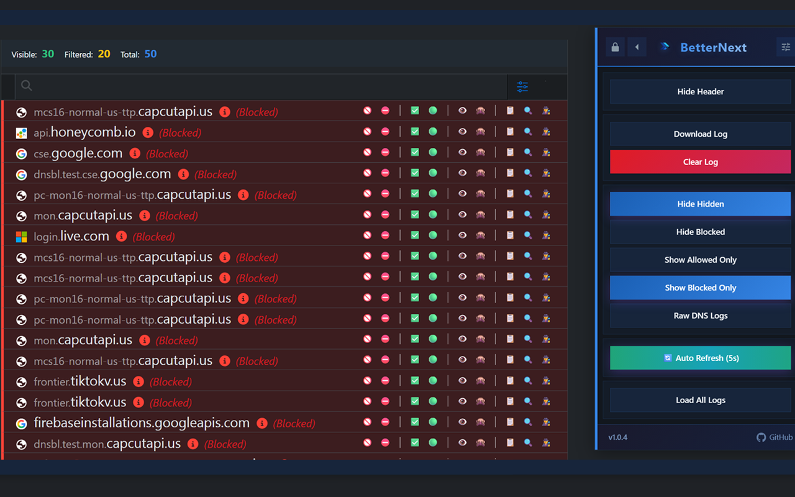

<p align="center">
  
</p>

<h1 align="center">BetterNext</h1>
<p align="center">
  <strong>Enhanced NextDNS Control Panel</strong><br/>
  A Chrome extension that transforms the NextDNS dashboard into a power-user experience.
</p>

<p align="center">
  <a href="https://chromewebstore.google.com/detail/betternext-enhanced-nextd/ekhchbdpkkjlcpelfmdbjapjcenabfgn"></a>
  
  
  
</p>

---

## Overview

BetterNext injects a floating control panel, analytics dashboard, and quality-of-life tools into the NextDNS web interface. Navigate between sections, manage domains, review logs, and monitor analytics — all without the extra clicks.

<p align="center">
  
</p>

---

## Features

| Category | Details |
|---|---|
| **Floating Control Panel** | Draggable, resizable, persistent position. Always-on access to quick actions, navigation, and filters. |
| **Analytics Dashboard** | Custom API-driven analytics page with stat cards, ring charts, bar charts, data tables, and CSV/JSON export. Replaces the default NextDNS analytics view. |
| **Log Enhancements** | Filter by Allowed / Blocked / Cached. Hide specific domains. Compact mode. Auto-refresh with configurable interval. Log counters. |
| **Domain Management** | One-click allow/deny actions. Bulk delete tools. Domain action history tracking. CNAME chain display. |
| **Profile Tools** | Profile import/export. Cross-profile config sync. DNS rewrite management. Parental control quick-toggles. |
| **HaGeZi Integration** | One-click TLD blocklist and allowlist sync from HaGeZi's curated lists. |
| **Webhook Alerts** | Send domain query events to Discord, Slack, or any webhook endpoint. |
| **Theming** | Dark, Dark Blue, and Light themes. List page theme override. Ultra-condensed mode. Custom CSS support. |

---

## Installation

### Chrome Web Store (Recommended)

<a href="https://chromewebstore.google.com/detail/betternext-enhanced-nextd/ekhchbdpkkjlcpelfmdbjapjcenabfgn">
  
</a>

### From Source

```
git clone https://github.com/SysAdminDoc/BetterNext.git
```

1. Open `chrome://extensions/`
2. Enable **Developer mode** (top-right)
3. Click **Load unpacked** and select the cloned folder
4. Visit [my.nextdns.io](https://my.nextdns.io)

### Userscript Version

A Tampermonkey/Violentmonkey-compatible userscript is also available at [`userscript/BetterNext.user.js`](userscript/BetterNext.user.js).

---

## Setup

1. Install the extension and visit any NextDNS page
2. The panel will prompt you to connect your API key
3. Click **"Take Me There!"** to navigate to your account page
4. Click **"Capture Key & Continue"** — your key is stored locally and BetterNext is ready

> Your API key never leaves your browser. It is stored in `chrome.storage.local` and only used for direct requests to the NextDNS API.

---

## Permissions

| Permission | Purpose |
|---|---|
| `storage` | Saves panel position, UI preferences, filters, and API key locally |
| `clipboardWrite` | Enables one-click copy for domains and exported data |
| `host_permissions` | Allows the extension to run on `my.nextdns.io` and make requests to `api.nextdns.io` |

---

## Project Structure

```
BetterNext/
├── manifest.json               # Chrome MV3 extension manifest
├── background.js               # Service worker — proxies API requests (CORS bypass)
├── content.js                  # Main content script — UI, logic, analytics
├── userscript/
│   └── BetterNext.user.js      # Standalone userscript version
├── icons/
│   ├── icon16.png
│   ├── icon48.png
│   ├── icon128.png
│   └── logo.png
├── LICENSE
└── README.md
```

---

## Support NextDNS

If BetterNext improves your workflow, consider supporting NextDNS with a Pro subscription:

<a href="https://nextdns.io/?from=6mrqtjw2">
  
</a>

---

## License

MIT — see [LICENSE](LICENSE) for details.

---

<p align="center">
  Built by <a href="https://github.com/SysAdminDoc"><strong>Matt Parker</strong></a>
</p>
